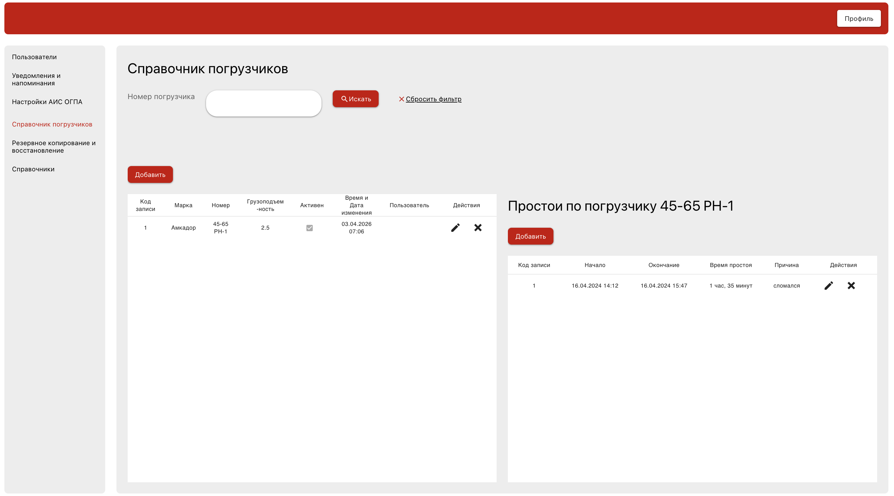

# Forklift Directory

Fullstack application to manage forklifts directory and malfunctions related to them based on Java, Spring Boot, Vue.js.



## Features

- forklifts search by number,
- forklifts creating,
- forklifts modification,
- forklifts removal,
- malfunctions search by selected forklifts record,
- malfunctions creation, 
- malfunctions modification,
- malfunctions removal.

## Getting started

To get a local copy up and running you need [Git](https://git-scm.com/install/) to clone the project (or download a zip version of the project)
and [Docker](https://www.docker.com/products/docker-desktop/) to run the project.

## Installation

1) Clone the repo
```
git clone https://github.com/aliakseisilivonchyk/forklift-directory.git
```
2) Start the project using Docker
```
docker compose up -d
```
